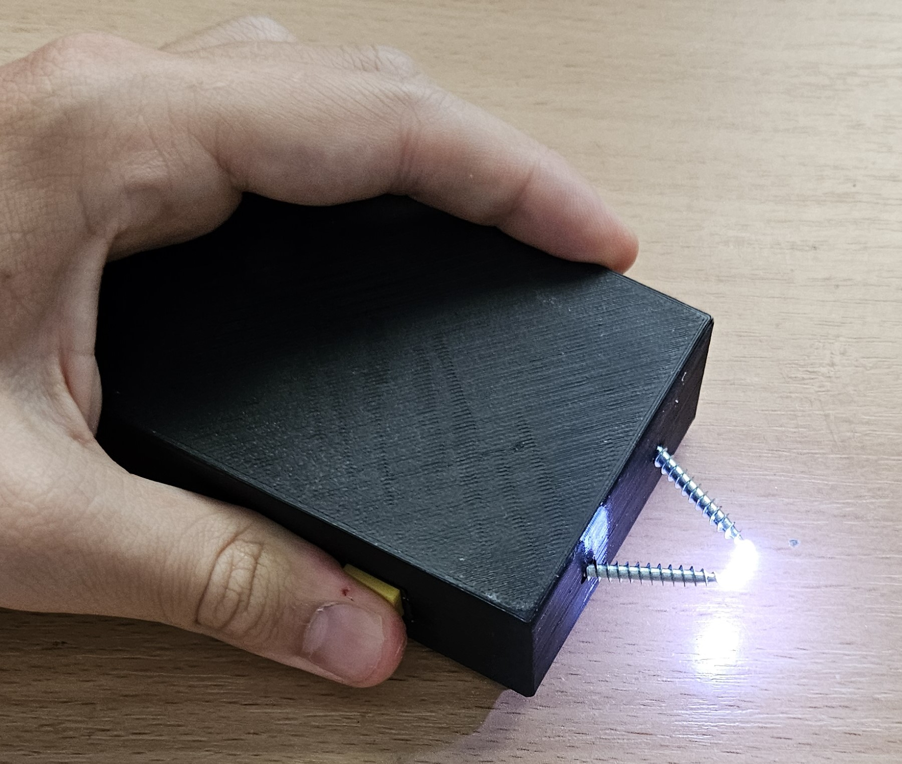

# Definitely-Not-A-Stun-Gun

Made as part of Arcade Hack Club
Used github copilot when writing README

Around two years ago, I bought one of those super cheap high voltage generators on Aliexpress.

I has been sitting in my drawer since then, but now I finally decided to do something with it.
I built a stun gun with it.

:warning:   :warning:   :warning:   :warning:   :warning:   :warning:   :warning:   :warning:   :warning:   :warning:   :warning:   :warning:   :warning:   :warning:
## Disclaimer
I live in Czech Republic, where owning a stun gun is legal, as long as it is the kind that does not fires its contacts and the owner is over 18 years old.
I am not responsible for any harm you cause to yourself or others with this device.
This is a dangerous device!
Make sure to check the laws in your country before building one.
Please be careful and use it responsibly.

## Parts
- Sketchy high voltage generator
- 1 Li-ion/Li-Po battery
- TP4056 charging and protection module
- Rocker switch
- 2 Push buttons
- Screws (used as electrodes)
- Some wire
- 3D printed case
- 4 M3x8 screws
- 4 6x4.5 threaded inserts
- Hot glue

## Circuit

All the components are connected in series.
This means that in order to turn the device on, the switch must be on and both buttons must be pressed.
The buttons are used as a safety feature to prevent accidental shock.
They are positioned on the opposite sides of the case, so the user must hold the device securely in order to use it.
